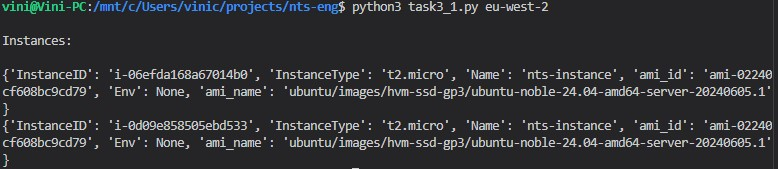
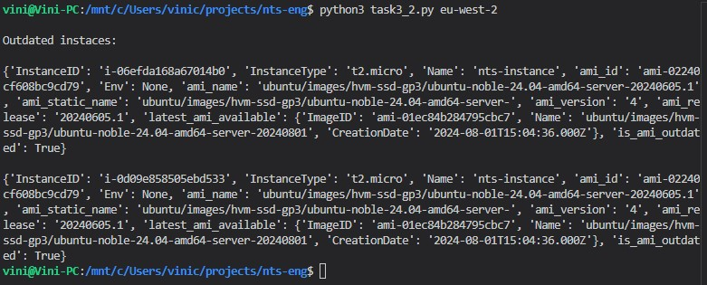
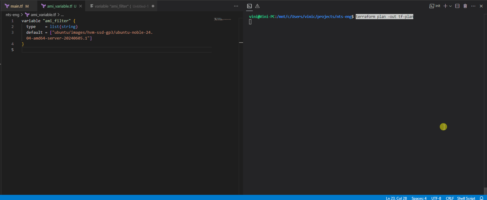
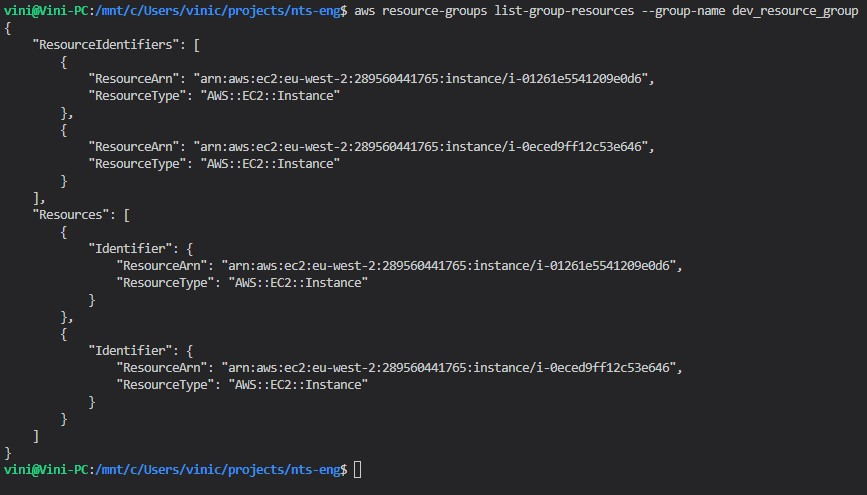
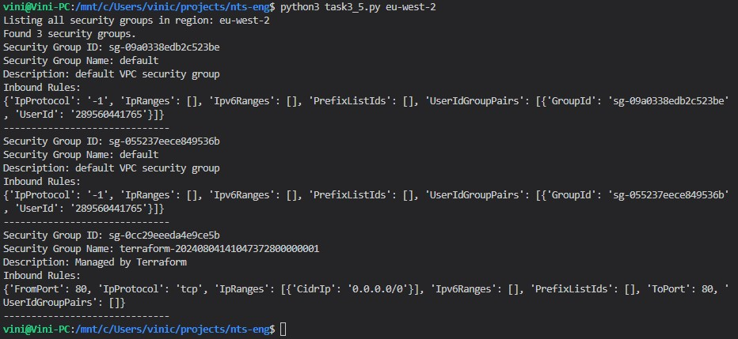
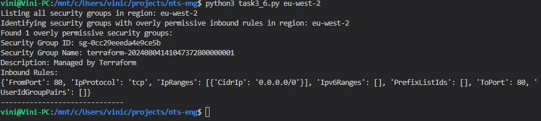
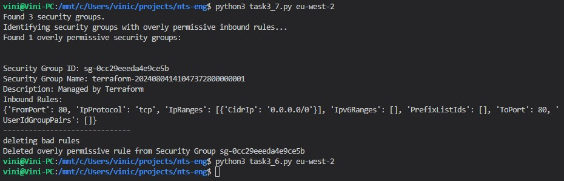

# nts-eng

Hello.

### Instance Security:

1. List all running instances in a specified region.
2. Check if instances are using the latest Amazon Machine Image (AMI).
3. Implement a function to update instances with outdated AMIs.
4. List all environments using instances tags (dev, prod, staging)

### Network Security:

5. List all security groups in a specified region.
6. Identify security groups with overly permissive inbound rules (allowing all traffic) and
   print their details.
7. Implement a function to update security groups to restrict overly permissive rules.

### 1: List all running instances in a specified region.

run:

```shell
python3 task3_1.py eu-west-2
```

example output: <br />

<br /><br />

### 2: Check if instances are using the latest Amazon Machine Image (AMI).

run:

```shell
python3 task3_2.py eu-west-2
```

example output: <br />

<br /><br />

### 3: Implement a function to update instances with outdated AMIs.

The terraform code uses `aws_autoscaling_group` and `aws_launch_configuration`, which are fed by the resource `data.aws_ami.ubuntu-linux` to dynamically pull AMI information when building ec2 instances. To do that, it uses a _filter_, contained in a variable on dedicated file `ami_variable.tf`. When this file is replaced, Terraform will have definition of a new AMI available. This file is replaced upon execution of python script below, which pulls the latest AMI information - this could be later made into a Lambda function.
Terraform currently contains an old release `20240605`. The expected update at of time of writing is the release from `20240605.1` to `20240801`

First deploy the instances

```shell
terraform plan -out tf-plan; terraform apply tf-plan
```

Run python script to update the variable:

```shell
python3 task3_3.py
```

Check new plan that updates are necessary.

```shell
terraform plan -out tf-plan
```

example output: <br />

<br /><br />

_clean-up_

```shell
terraform destroy -auto-approve
```

### 4: List all environments using instances tags (dev, prod, staging)

In the terraform file `resource_group.tf` has been created. Resource groups can be easily used to enumerate resources based on attributes such as tags.
run:

```shell
aws resource-groups list-group-resources --group-name dev_resource_group
```

example output: <br />

<br /><br />

### 5: List all security groups in a specified region.

run:

```shell
python3 task3_5.py eu-west-2
```

example output: <br />

<br /><br />

### 6:Identify security groups with overly permissive inbound rules (allowing all traffic) and print their details.

run:

```shell
python3 task3_6.py eu-west-2
```

example output: <br />

<br /><br />

### 7: Implement a function to update security groups to restrict overly permissive rules.

run:

```shell
python3 task3_7.py eu-west-2
```

Then check that none is left using instruction 6.
run:

```shell
python3 task3_6.py eu-west-2
```

example output: <br />

<br /><br />
